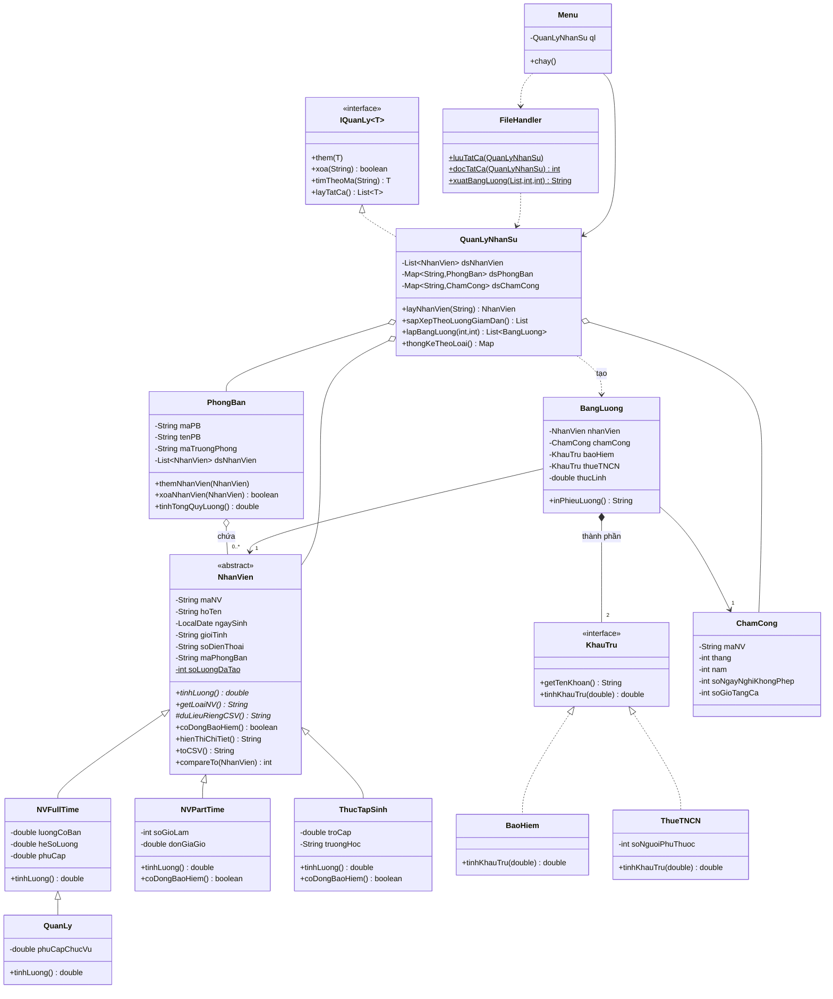

# Quản lý Nhân sự & Tính lương (Java OOP)

Bài tập nhóm môn Lập trình hướng đối tượng. Chương trình console quản lý nhân viên,
phòng ban, chấm công và lập bảng lương tháng (có bảo hiểm, thuế TNCN lũy tiến).

Yêu cầu: **JDK 11 trở lên**. Không dùng thư viện ngoài.

---

## 1. Bảng phân công

| Thành viên | Package / file phụ trách | Kiến thức OOP thể hiện |
|---|---|---|
| **Người 1** (trưởng nhóm) | `src/model/` — `NhanVien` (abstract), `NVFullTime`, `NVPartTime`, `ThucTapSinh`, `QuanLy`, `PhongBan`<br>+ tạo repo, `README.md`, `.gitignore`, vẽ sơ đồ lớp | Trừu tượng, kế thừa nhiều tầng, đa hình (`tinhLuong()`), đóng gói (setter có kiểm tra), `Comparable`, `equals/hashCode`, Template Method (`toCSV()`) |
| **Người 2** | `src/exception/` — `NhanVienKhongTonTaiException`, `DuLieuKhongHopLeException`<br>`src/service/` — `KhauTru` (interface), `BaoHiem`, `ThueTNCN`, `ChamCong`, `BangLuong` | Interface, hiện thực interface, đa hình qua interface, composition, checked vs unchecked exception |
| **Người 3** | `src/manager/` — `IQuanLy<T>`, `QuanLyNhanSu`, `FileHandler`, `DuLieuMau`<br>`src/ui/Menu.java`, `src/Main.java` | Generic interface, Collection (`ArrayList`, `LinkedHashMap`, `TreeMap`), `Comparator`/lambda, đọc ghi file, try-catch, `instanceof` + ép kiểu |

**Thứ tự phụ thuộc:** `model` ← `service` ← `manager/ui`.
Người 1 push trước, Người 2 push sau, Người 3 merge cuối.

---

## 2. Hướng dẫn Git cho từng người

### Người 1 — tạo repo và push phần `model`

1. Lên GitHub tạo repo **trống** tên `QuanLyNhanSu` (không tick "Add README").
2. Vào *Settings → Collaborators* thêm tài khoản GitHub của Người 2 và Người 3.
3. Trên máy:

```bash
git clone https://github.com/<ten-nguoi-1>/QuanLyNhanSu.git
cd QuanLyNhanSu
# copy vào: README.md, .gitignore, thư mục src/model/
git add README.md .gitignore src/model
git commit -m "Them cac lop model: NhanVien, NVFullTime, NVPartTime, ThucTapSinh, QuanLy, PhongBan"
git push origin main
```

### Người 2 — branch `nguoi2-service`

```bash
git clone https://github.com/<ten-nguoi-1>/QuanLyNhanSu.git
cd QuanLyNhanSu
git checkout -b nguoi2-service
# copy vào: src/exception/ và src/service/
git add src/exception src/service
git commit -m "Them exception va service: KhauTru, BaoHiem, ThueTNCN, ChamCong, BangLuong"
git push -u origin nguoi2-service
```

Sau đó lên GitHub bấm **Compare & pull request** → Người 1 review và **Merge** vào `main`.

### Người 3 — branch `nguoi3-giaodien`

```bash
git clone https://github.com/<ten-nguoi-1>/QuanLyNhanSu.git
cd QuanLyNhanSu
git checkout -b nguoi3-giaodien
# copy vào: src/manager/, src/ui/, src/Main.java
git add src/manager src/ui src/Main.java
git commit -m "Them quan ly, doc ghi file, menu va Main"
git pull origin main          # lấy phần của Người 2 sau khi đã merge
git push -u origin nguoi3-giaodien
```

Tạo pull request → Người 1 merge. Xong, `main` chạy được đầy đủ.

### Mẹo để lịch sử commit đẹp (cô có thể xem)

- **Không push hết 1 lần.** Mỗi người nên commit từng lớp một, ví dụ Người 1:
  `NhanVien` → `NVFullTime` → `NVPartTime` → `ThucTapSinh` → `QuanLy` → `PhongBan`.
- Cấu hình tên đúng trước khi commit: `git config user.name "Ho Ten"` và `git config user.email "email@..."`.
- Sửa lỗi sau khi merge: `git checkout main && git pull`, tạo branch mới `fix-...`.

---

## 3. Chạy chương trình

**IntelliJ / NetBeans / VS Code:** mở thư mục project, đánh dấu `src` là Source Root, chạy `Main`.
Đặt encoding project là **UTF-8** để hiện tiếng Việt.

**Dòng lệnh** (Windows chạy `chcp 65001` trước để hiện tiếng Việt):

```bash
javac -encoding UTF-8 -d out -sourcepath src src/Main.java
java -cp out Main
```

Lần đầu chương trình tự nạp **7 nhân viên mẫu**. Chọn `11` để lưu, dữ liệu nằm trong `data/`.

---

## 4. Sơ đồ lớp (UML)

GitHub tự vẽ sơ đồ dưới đây. Để đưa vào báo cáo: dán khối code vào <https://mermaid.live> rồi xuất PNG,
hoặc vẽ lại bằng draw.io / StarUML theo đúng các lớp này.



**Các loại quan hệ thể hiện trong sơ đồ:**

| Ký hiệu | Quan hệ | Ví dụ |
|---|---|---|
| `<\|--` | Kế thừa | `NVFullTime` kế thừa `NhanVien`; `QuanLy` kế thừa `NVFullTime` |
| `<\|..` | Hiện thực interface | `BaoHiem`, `ThueTNCN` hiện thực `KhauTru` |
| `o--` | Kết tập (aggregation) | `PhongBan` chứa `NhanVien` (xóa phòng, NV vẫn còn) |
| `*--` | Thành phần (composition) | `BangLuong` tự tạo `BaoHiem`, `ThueTNCN` bên trong |
| `-->` | Kết hợp (association) | `BangLuong` tham chiếu `NhanVien`, `ChamCong` |
| `..>` | Phụ thuộc (dependency) | `QuanLyNhanSu` tạo `BangLuong` |

---

## 5. Công thức tính lương

| Loại | `tinhLuong()` | Đóng bảo hiểm |
|---|---|---|
| Toàn thời gian | lương cơ bản × hệ số + phụ cấp | Có |
| Quản lý | lương toàn thời gian + phụ cấp chức vụ | Có |
| Bán thời gian | số giờ × đơn giá giờ | Không |
| Thực tập sinh | trợ cấp | Không |

Bảng lương tháng (`BangLuong`):

- Tăng ca = giờ tăng ca × (lương / 26 / 8) × 1.5
- Trừ nghỉ = lương / 26 × số ngày nghỉ không phép
- Bảo hiểm = 10.5% lương (BHXH 8% + BHYT 1.5% + BHTN 1%)
- Thuế TNCN = lũy tiến 7 bậc trên (thu nhập − bảo hiểm − giảm trừ gia cảnh)
- **Thực lĩnh = tổng thu nhập − bảo hiểm − thuế**

> Các mức giảm trừ, bậc thuế là số **minh họa** cho bài tập, nằm trong hằng số của `ThueTNCN`
> và `BaoHiem`, sửa dễ dàng nếu cần.

---

## 6. Gợi ý phát triển thêm (nếu còn thời gian)

- Giao diện Swing (`JFrame` + `JTable`) thay cho menu console: chỉ cần viết lớp mới trong `ui/`,
  không phải sửa `model`, `service`, `manager`.
- Thêm loại nhân viên mới (ví dụ `NVHopDong`): chỉ cần kế thừa `NhanVien` và thêm 1 `case` trong `FileHandler`.
- Thêm khoản khấu trừ mới (ví dụ `PhiCongDoan`): tạo lớp hiện thực `KhauTru`.
